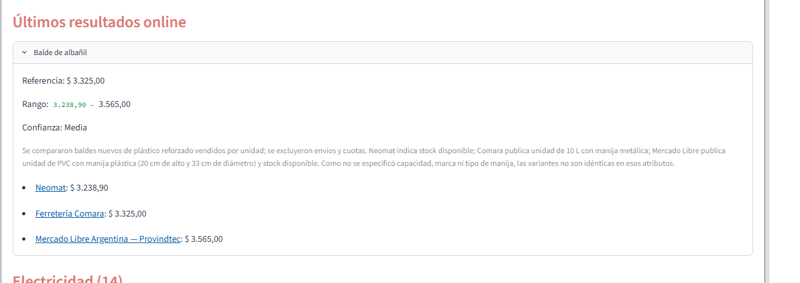

# Evidencia — cálculo de precios

- **Producto:** Balde de albañil
- **Precio de referencia:** $ 3.325,00
- **Rango observado:** $ 3.238,90 a $ 3.565,00
- **Confianza:** Media
- **Fuentes comparadas:** Neomat, Ferretería Comara y Mercado Libre Argentina — Providentec.
- **Criterio:** comparación de productos similares vendidos por unidad; se excluyeron envíos y cuotas.
- **Fecha de la corrida:** 07/09/2026

